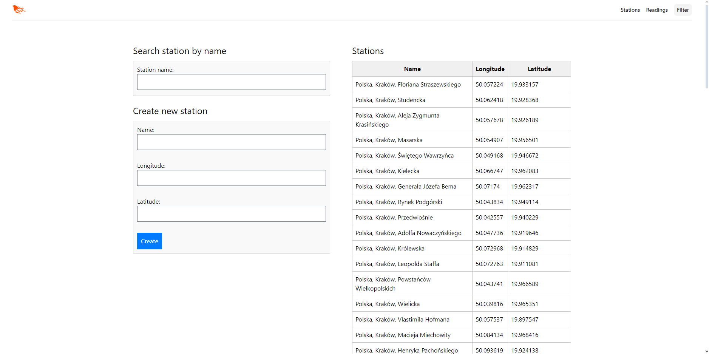
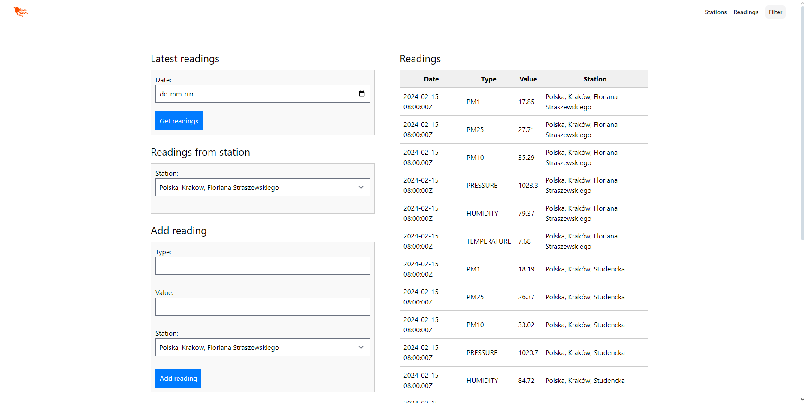
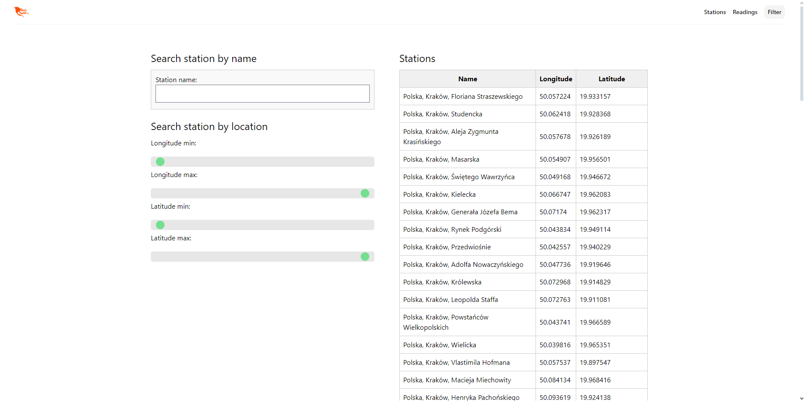

# Pollution Controller

<h3>This project was made during the Erlang and Elixir Programming course at the AGH UST in 2023/2024.</h3>

## Description

`Pollution Controller` is a web application built with `Elixir` and the `Phoenix` framework, designed to monitor and manage pollution data from various stations. Leveraging `Ecto`, a powerful database wrapper in `Elixir`, `Pollution Controller` provides robust data storage and retrieval capabilities, ensuring seamless management of environmental metrics. It enables real-time visualization and analysis of pollution data, empowering users to track pollution levels across different locations with ease.

## Technologies Used

- Elixir
- Phoenix Framework
- Ecto

## Features

- **Real-time Data:** Monitor pollution levels with live updates from connected stations.
- **Data Visualization:** Visualize data trends and historical records through interactive charts.
- **Location-based Insights:** Analyze pollution data based on geographic locations.
- **User-friendly Interface:** Intuitive interface for easy navigation and data exploration.

## Screenshots







## Setup

To run the `Pollution Controller`, follow these steps:

1. **Install Elixir:** 
    Ensure you have Elixir installed, otherwise you can do so at https://elixir-lang.org/install.html.
2. **Clone the Repository:**
    To clone the project repository, open your terminal or command prompt and enter the following command:
    ```
    git clone https://github.com/TommyFurgi/Pollution-Controller.git
    ```
3. **Open Project:** 
    Once the repository has been cloned, navigate into the cloned project directory using the `cd` command in your terminal or command prompt. For example:
    ```
    cd .\Pollution-Controller
    ```
4. **Install dependencies:** 
    Inside the project directory, install the dependencies by running the following command:
    ```
    mix deps.get
    ```
5. **Set up the database:** 
    Configure your database settings in `config/dev.exs` or `config/prod.exs` depending on your environment. Ensure the database server is running, then create and migrate your database by running:
    ```
    mix ecto.setup
    ```
    This command will create the database, run migrations, and seed the database if necessary.

6. **Run application:** 
    To start the Phoenix server and run the application, use the following command:
    ```
    mix phx.server
    ```
    This command compiles and starts the Phoenix application, making it accessible locally at http://localhost:4000. Enjoy!